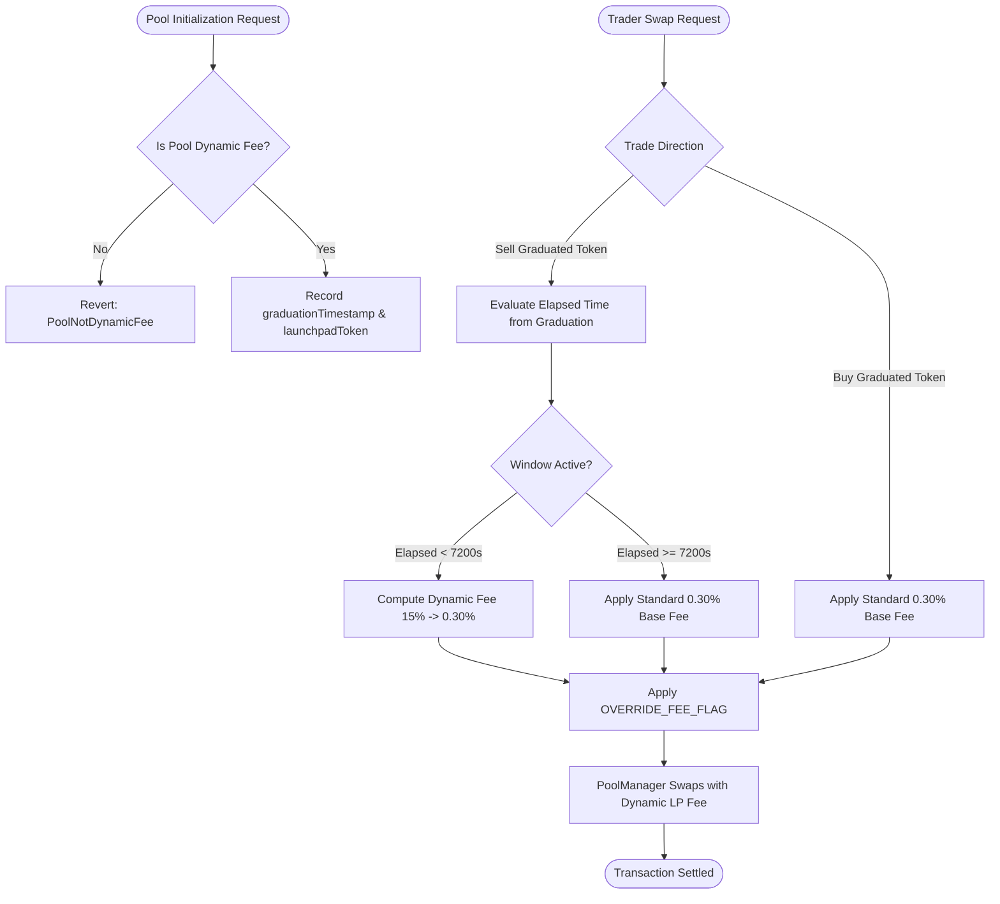

# GraduationShieldHook: Dynamic Liquidity Defense for Uniswap v4

> A production-grade Uniswap v4 Hook implementing dynamic time-decay exit fees on sells with dynamic LP fee override via `LPFeeLibrary.OVERRIDE_FEE_FLAG`.

---

## Executive Summary

When token launchpads (e.g. pump.fun or bonding-curve protocols) transition from an internal curve to an Automated Market Maker (AMM) pool, the pool faces an asymmetric structural risk known as the **Graduation Cliff**. Early discount buyers, having acquired large positions at steep discounts on the bonding curve, are incentivized to immediately exit their positions upon pool launch. This drains quote reserves (ETH/USDC), crashes market depth, and imposes severe impermanent loss on initial liquidity providers.

`GraduationShieldHook` is an institutional-grade defense mechanism designed to mitigate this dynamic by:
1. Imposing a temporary, linearly decaying exit fee on sells of the graduated asset (15.00% decaying to 0.30% over a configurable window of 2 hours / 7,200 seconds).
2. Maintaining a standard 0.30% fee on all buys throughout the entire lifecycle.
3. Overriding the pool's LP fee dynamically via `LPFeeLibrary.OVERRIDE_FEE_FLAG` inside `beforeSwap`.
4. Enforcing that pools must initialize with `LPFeeLibrary.DYNAMIC_FEE_FLAG` during `beforeInitialize`.
5. Implementing clean address bitmask verification via `Hooks.validateHookPermissions`.

---

## Mechanism Design & Mathematical Formulation

### 1. Linear Decay Trajectory

The exit fee $F_{\text{sell}}(t)$ decays linearly from an initial penalty $F_{\text{initial}}$ to a baseline pool fee $F_{\text{base}}$ across a configurable duration $T_{\text{decay}}$:

$$\Delta t = \min(\max(0, \text{block.timestamp} - t_{\text{graduation}}), T_{\text{decay}})$$

$$F_{\text{decay}}(\Delta t) = \frac{\Delta t \times (F_{\text{initial}} - F_{\text{base}})}{T_{\text{decay}}}$$

$$F_{\text{sell}}(\Delta t) = F_{\text{initial}} - F_{\text{decay}}(\Delta t)$$

Where fees are denominated in pips (hundredths of a basis point, $10^6 = 100\%$):
- $F_{\text{initial}} = 150,000$ (15.00%)
- $F_{\text{base}} = 3,000$ (0.30%)
- $T_{\text{decay}} = 7,200\text{ seconds}$ (2 hours)

### Fee Milestones

| Timeline | Elapsed ($\Delta t$) | Duration Ratio | Sell Fee ($F_{\text{sell}}$) | Buy Fee ($F_{\text{buy}}$) |
|---|---|---|---|---|
| Graduation ($T_0$) | 0 seconds | 0.00% | 15.000% (150,000 pips) | 0.300% (3,000 pips) |
| Checkpoint 1 | 30 minutes (1,800s) | 25.00% | 11.325% (113,250 pips) | 0.300% (3,000 pips) |
| Midpoint ($T_{1/2}$) | 1 hour (3,600s) | 50.00% | 7.650% (76,500 pips) | 0.300% (3,000 pips) |
| Checkpoint 3 | 1.5 hours (5,400s) | 75.00% | 3.975% (39,750 pips) | 0.300% (3,000 pips) |
| Maturity ($T_{\text{decay}}$) | 2 hours (7,200s) | 100.00% | 0.300% (3,000 pips) | 0.300% (3,000 pips) |
| Post-Maturity | > 2 hours | N/A | 0.300% (3,000 pips) | 0.300% (3,000 pips) |

---

## Protocol Flow



---

## Hook Address Bitmask & CREATE2 Derivation

Uniswap v4 requires hook contracts to be deployed at an address whose lowest 14 bits match the permissions declared in `getHookPermissions()`.

### Required Flags

| Permission Flag | Bit Position | Hex Mask | Function |
|---|---|---|---|
| `BEFORE_INITIALIZE_FLAG` | Bit 13 (`1 << 13`) | `0x2000` | Verifies dynamic fee pool and registers shield configuration. |
| `BEFORE_SWAP_FLAG` | Bit 7 (`1 << 7`) | `0x0080` | Intercepts swaps, computes direction, and overrides pool LP fee. |
| **Combined Target Bitmask** | | **`0x2080`** | Validated in constructor via `Hooks.validateHookPermissions`. |

---

## Security & Verification

### 1. Mandatory Dynamic Fee Pool Guard
Pools must be initialized with `key.fee.isDynamicFee()`. Any attempt to initialize a static-fee pool with this hook reverts immediately with `PoolNotDynamicFee()`.

### 2. Directional Trade Identification
Trade direction is checked dynamically against `poolShields[poolId].launchpadToken`:
- When `zeroForOne == true` and `shield.launchpadToken == key.currency0`, the user is selling the launchpad token for reserve tokens.
- When `zeroForOne == false` and `shield.launchpadToken == key.currency1`, the user is selling the launchpad token for reserve tokens.
- All other swaps are classified as buys or quote-side swaps and incur only standard base fees.

### 3. Permission Integrity
The contract inherits `BaseHook` which calls `Hooks.validateHookPermissions(this, getHookPermissions())` in its constructor. If the deployed address does not strictly fulfill `0x2080`, the deployment reverts.

---

## Verification & Test Suite

The repository includes a comprehensive test suite in [`test/GraduationShieldHook.t.sol`](file:///C:/Users/micha/.gemini/antigravity-ide/scratch/v4-graduation-shield/test/GraduationShieldHook.t.sol):

```shell
forge test -vvv
```

### Test Suite Execution Summary

```text
Ran 7 tests for test/GraduationShieldHook.t.sol:GraduationShieldHookTest
[PASS] test_BuySwapStandardFee() (gas: 135658)
[PASS] test_CalculateDynamicFee_Trajectory() (gas: 19481)
[PASS] test_Permissions() (gas: 10763)
[PASS] test_PoolInitialization() (gas: 15154)
[PASS] test_RevertIfPoolNotDynamicFee() (gas: 22419)
[PASS] test_SellSwapCliffMaxFee() (gas: 141881)
[PASS] test_SellSwapPostDecay() (gas: 144648)
Suite result: ok. 7 passed; 0 failed; 0 skipped; finished in 1.89ms
```

---

## Salt Mining & Deployment Guide

To deploy `GraduationShieldHook` using the CREATE2 deployment pattern:

```shell
forge script script/DeployShieldHook.s.sol
```

### Deterministic Mining Output
```text
== Logs ==
  Mining CREATE2 salt for deployer: 0x4e59b44847b379578588920cA78FbF26c0B4956C
  Target flags bitmask: 0x2080
  Found salt:
  0x0000000000000000000000000000000000000000000000000000000000002019
  Expected hook address: 0x2b552A9287443191a4733322068e8EE11714a080
  Successfully deployed GraduationShieldHook at: 0x2b552A9287443191a4733322068e8EE11714a080
```

Bitmask verification:
$$0\text{x2b552A9287443191a4733322068e8EE11714a080} \ \& \ 0\text{x3FFF} = 0\text{x2080}$$

---

## Directory Structure

```text
├── src/
│   ├── GraduationShieldHook.sol   # Dynamic exit fee calculation and LP fee override
│   └── base/
│       └── BaseHook.sol           # Base contract with internal hook dispatching
├── script/
│   ├── DeployShieldHook.s.sol     # CREATE2 deployment script
│   └── MineHookSalt.s.sol         # CREATE2 address bitmask salt miner (0x2080)
├── test/
│   ├── GraduationShieldHook.t.sol # Unit and integration tests with Uniswap v4 test harness
│   └── utils/
│       └── HookMiner.sol          # Reusable CREATE2 hook salt mining library
├── foundry.toml                   # Compiler settings: solc 0.8.26, cancun EVM, via_ir enabled
└── remappings.txt                 # Canonical dependencies: v4-core, v4-periphery, openzeppelin
```

---

## License

This project is licensed under the [MIT License](LICENSE).
