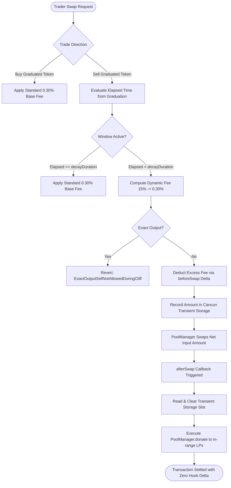

# GraduationShieldHook: Dynamic Liquidity Defense for Uniswap v4

> A production-grade Uniswap v4 Hook implementing dynamic time-decay exit fees on sells with direct excess fee redistribution to active liquidity providers via `PoolManager.donate()`.

---

## Executive Summary

When token launchpads (e.g. pump.fun or bonding-curve protocols) transition from an internal curve to an Automated Market Maker (AMM) pool, the pool faces an asymmetric structural risk known as the **Graduation Cliff**. Early discount buyers, having acquired large positions at steep discounts on the bonding curve, are incentivized to immediately exit their positions upon pool launch. This drains quote reserves (ETH/USDC), crashes market depth, and imposes severe impermanent loss on initial liquidity providers.

`GraduationShieldHook` is an institutional-grade defense mechanism designed to mitigate this dynamic by:
1. Imposing a temporary, linearly decaying exit fee on sells of the graduated asset (15.00% decaying to 0.30% over a configurable window).
2. Maintaining a standard 0.30% fee on all buys throughout the entire lifecycle.
3. Intercepting the excess exit fee ($F_{\text{excess}} = F_{\text{sell}} - F_{\text{base}}$) using Uniswap v4's `BeforeSwapDelta` and donating 100% of these tokens directly back to active in-range liquidity providers via `PoolManager.donate()`.
4. Disallowing exact-output sells during the active defense window to eliminate fee evasion and sandwich vectors.
5. Leveraging EVM Cancun transient storage (`tstore` / `tload`) for cross-hook execution safety and gas efficiency.

---

## Mechanism Design & Mathematical Formulation

### 1. Linear Decay Trajectory

The exit fee $F_{\text{sell}}(t)$ decays linearly from an initial penalty $F_{\text{initial}}$ to a baseline pool fee $F_{\text{base}}$ across a configurable duration $T_{\text{decay}}$:

$$\Delta t = \min(\max(0, \text{block.timestamp} - t_{\text{graduation}}), T_{\text{decay}})$$

$$F_{\text{excess}}(\Delta t) = (F_{\text{initial}} - F_{\text{base}}) \times \left(1 - \frac{\Delta t}{T_{\text{decay}}}\right)$$

$$F_{\text{sell}}(\Delta t) = F_{\text{base}} + F_{\text{excess}}(\Delta t)$$

Where fees are denominated in pips (hundredths of a basis point, $10^6 = 100\%$):
- $F_{\text{initial}} = 150,000$ (15.00%)
- $F_{\text{base}} = 3,000$ (0.30%)
- $T_{\text{decay}} = 604,800\text{ seconds}$ (7 days)

### Fee Milestones

| Timeline | Elapsed ($\Delta t$) | Duration Ratio | Sell Fee ($F_{\text{sell}}$) | Donated Excess ($F_{\text{excess}}$) | Buy Fee ($F_{\text{buy}}$) |
|---|---|---|---|---|---|
| Graduation ($T_0$) | 0 seconds | 0.00% | 15.000% (150,000 pips) | 14.700% (147,000 pips) | 0.300% (3,000 pips) |
| Checkpoint 1 | 1.75 days | 25.00% | 11.325% (113,250 pips) | 11.025% (110,250 pips) | 0.300% (3,000 pips) |
| Midpoint ($T_{1/2}$) | 3.50 days | 50.00% | 7.650% (76,500 pips) | 7.350% (73,500 pips) | 0.300% (3,000 pips) |
| Checkpoint 3 | 5.25 days | 75.00% | 3.975% (39,750 pips) | 3.675% (36,750 pips) | 0.300% (3,000 pips) |
| Maturity ($T_{\text{decay}}$) | 7.00 days | 100.00% | 0.300% (3,000 pips) | 0.000% (0 pips) | 0.300% (3,000 pips) |
| Post-Maturity | > 7.00 days | N/A | 0.300% (3,000 pips) | 0.000% (0 pips) | 0.300% (3,000 pips) |

### 2. Price Floor Defense via Direct LP Redistribution

Unlike traditional launchpad tax mechanisms that route penalties to external treasuries or dead addresses, `GraduationShieldHook` returns 100% of the excess exit fee directly to the pool's in-range liquidity providers:

$$\text{DonationAmount} = \frac{|\Delta_{\text{specified}}| \times F_{\text{excess}}}{10^6}$$

Inside `afterSwap`, the hook calls:
```solidity
poolManager.donate(key, donate0, donate1, "");
```
This increases the pool's global fee accumulator:
$$\text{feeGrowthGlobal} \leftarrow \text{feeGrowthGlobal} + \frac{\text{DonationAmount} \times 2^{128}}{L_{\text{active}}}$$

Where $L_{\text{active}}$ is the pool's active in-range liquidity. Consequently:
- Dumping actors suffer direct economic dilution.
- Long-term liquidity providers receive immediate yield compensation that counterbalances price downward pressure.
- The effective cost of dumping increases exponentially with size, curbing cascades.

---

## Protocol Flow



---

## Hook Address Bitmask & CREATE2 Derivation

Uniswap v4 requires hook contracts to be deployed at an address whose lowest 14 bits match the permissions declared in `getHookPermissions()`.

### Required Flags

| Permission Flag | Bit Position | Hex Mask | Function |
|---|---|---|---|
| `AFTER_INITIALIZE_FLAG` | Bit 12 (`1 << 12`) | `0x1000` | Registers pool graduation parameters upon initialization. |
| `BEFORE_SWAP_FLAG` | Bit 7 (`1 << 7`) | `0x0080` | Intercepts swaps, calculates exit decay, and returns deltas. |
| `AFTER_SWAP_FLAG` | Bit 6 (`1 << 6`) | `0x0040` | Executes `poolManager.donate()` with intercepted excess fees. |
| `BEFORE_SWAP_RETURNS_DELTA_FLAG` | Bit 3 (`1 << 3`) | `0x0008` | Authorizes the hook to return non-zero `BeforeSwapDelta`. |
| **Combined Target Bitmask** | | **`0x10C8`** | Validated in constructor via `Hooks.validateHookPermissions`. |

---

## Security & Threat Model

### 1. Anti-Fee Evasion via Exact-Output Rejection
In exact-output swaps (`amountSpecified > 0`), the user specifies the exact amount of reserve currency they want to withdraw. Computing an input penalty after the swap would require reverse-solving the curve and returning negative unspecified deltas, creating rounding leakage. To completely prevent evasion and sandwich attacks, the hook strictly reverts exact-output sells during the active cliff period (`ExactOutputSellNotAllowedDuringCliff`). Exact-output sells are re-enabled once the decay window matures.

### 2. EVM Cancun Transient Storage
The hook communicates between `beforeSwap` and `afterSwap` using `tstore` and `tload` opcodes on the slot `keccak256("graduation.shield.excess.donate")`. Because transient storage automatically resets to zero at transaction termination, cross-swap state pollution is impossible, reentrancy vulnerabilities are mitigated, and gas costs are minimized compared to conventional storage slots.

### 3. Permission Integrity
The contract inherits `BaseHook` which calls `Hooks.validateHookPermissions(this, getHookPermissions())` in its constructor. If the deployed address does not strictly fulfill `0x10C8`, the constructor immediately reverts.

---

## Verification & Test Suite

The repository includes a comprehensive test suite in [`test/GraduationShieldHook.t.sol`](file:///C:/Users/micha/.gemini/antigravity-ide/scratch/v4-graduation-shield/test/GraduationShieldHook.t.sol) testing all aspects of configuration, permissions, directional fees, decay trajectory, error bubbling, and fee growth accretion:

```shell
forge test -vvv
```

### Test Suite Execution Summary

```text
Ran 14 tests for test/GraduationShieldHook.t.sol:GraduationShieldHookTest
[PASS] test_BuySwapStandardFee() (gas: 143052)
[PASS] test_ExactOutputSellAllowedPostDecay() (gas: 147504)
[PASS] test_ExactOutputSellRevertsDuringCliff() (gas: 63988)
[PASS] test_InitialPoolConfiguration() (gas: 15843)
[PASS] test_Permissions() (gas: 10162)
[PASS] test_PriceFloorDefenseFeeGrowth() (gas: 170269)
[PASS] test_SellFee_At_FullDuration_T1() (gas: 20677)
[PASS] test_SellFee_At_Graduation_T0() (gas: 17733)
[PASS] test_SellFee_At_HalfDuration_T1_2() (gas: 21632)
[PASS] test_SellFee_At_QuarterDuration_T1_4() (gas: 21412)
[PASS] test_SellFee_At_ThreeQuartersDuration_T3_4() (gas: 21082)
[PASS] test_SellFee_Past_DecayWindow() (gas: 21007)
[PASS] test_SellImmediateCliffMaxFee() (gas: 172775)
[PASS] test_SellPostDecayDuration() (gas: 152857)
Suite result: ok. 14 passed; 0 failed; 0 skipped; finished in 2.72ms
```

---

## Salt Mining & Deployment Guide

To deploy `GraduationShieldHook` to an address satisfying `0x10C8`:

```shell
forge script script/MineHookSalt.s.sol
```

### Deterministic Mining Output
```text
== Logs ==
  Mining salt for deployer: 0x1804c8AB1F12E6bbf3894d4083f33e07309d1f38
  Required hook flags bitmask: 0x10C8
  Success! Found valid salt at iteration: 2406
  Salt: 0x0000000000000000000000000000000000000000000000000000000000000966
  Predicted Hook Address: 0x88a3Aa9ac53Ad33fcE2aFc9160BE2f0443EB90c8
```

Bitmask verification:
$$0\text{x88a3Aa9ac53Ad33fcE2aFc9160BE2f0443EB90c8} \ \& \ 0\text{x3FFF} = 0\text{x10C8}$$

---

## Directory Structure

```text
├── src/
│   ├── GraduationShieldHook.sol   # Dynamic exit fee calculation and LP donation logic
│   └── base/
│       └── BaseHook.sol           # Permission validation and callback access control
├── script/
│   └── MineHookSalt.s.sol         # CREATE2 address bitmask salt miner
├── test/
│   └── GraduationShieldHook.t.sol # 14 unit and integration tests with Uniswap v4 test harness
├── foundry.toml                   # Compiler settings: solc 0.8.26, cancun EVM, via_ir enabled
└── remappings.txt                 # Canonical dependencies: v4-core, v4-periphery, openzeppelin
```

---

## License

This project is licensed under the [MIT License](LICENSE).
